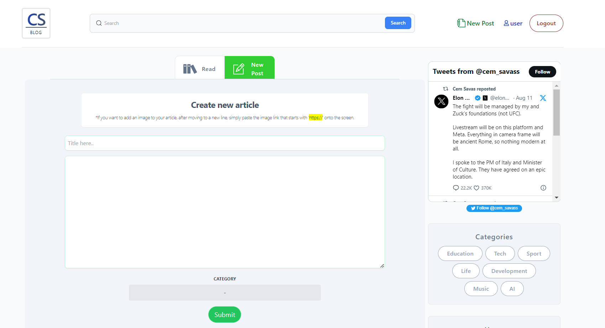

# Blog Application Created with Django REST Framework, ReactJS, and TailwindCSS
In this application, Django REST Framework is used on the backend, while ReactJS is used on the frontend. The application's design is built with TailwindCSS.

## User Authentication
User authentication in this application is handled by using Class-Based views provided by the Django SimpleJWT library on the backend, which associates JWTs with users to manage authentication on the frontend.

## Application Features
* When a user registers in the application, a profile area is created for the user using Django's signal structure.
* Users can customize their profile area by adding features such as a profile picture and education information.
* Users can perform CRUD operations on the posts they share.
* Users can search within the application by entering post or article titles.
* Users can categorize articles based on different categories.

## Running the Application Locally Using Docker.

#### Step 1: Clone this repository to your computer.

` git clone https://github.com/savascem/CS-Blog.git `

#### Step 2: Run the application using Docker.

` docker-compose up --build  `

#### Step 3: Access the APP

Visit http://127.0.0.1 in your browser and start using the application.

## How it Looks?

* Home Page

* Profile Page

* Read Article

* Search

* New Article

* Category Page

